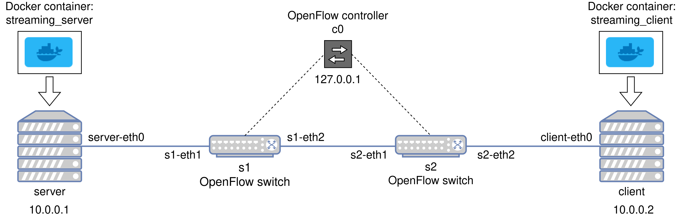

# Live video streaming in ComNetsEmu
This repository provides the code implementing a client/server live video streaming service in ComNetsEmu.

## 1. Requirements
In order to run the code, you need to have ComNetsEmu installed on your machine. The installation instructions are provided in the project's [repository](https://git.comnets.net/public-repo/comnetsemu). 

In addition, an X11 server such as Xorg (installed by default on Ubuntu) or XQuartz (available for macOS) is required on your machine in order to open GUI-based programs from within the ComNetsEmu VM. 

## 2. Setup
Once you have met the requirements, you can download the repository. The suggested location is the `app` folder inside ComNetsEmu's root directory. 

At that point, you must connect to the ComNetsEmu VM via SSH (using `vagrant ssh comnetsemu`) and run the setup script from within the root directory of this project. The command is the following:
```shell
./setup.sh
```
This script installs on the ComNetsEmu VM (for the root user) some Python packages required by the visualization script. 

Finally, you need to build the docker images of the streaming (server and client) services by running the command 
```shell
./build_docker_images.sh
```
In detail, the streaming server image is based on [tiangolo/nginx-rtmp](https://hub.docker.com/r/tiangolo/nginx-rtmp/), which provides a RTMP server for live video streaming, whereas the streaming client image is based on Ubuntu 20.04. Both include the `ffmpeg` framework, which is used to stream a local video via the RTMP protocol on the server side and to connect to the video stream on the client side. In addition, to dump the packets belonging to the video streaming flow, `tcpdump` is installed on both sides.

## 3. Usage
After the setup, you can start the program by executing the following command:
```shell
sudo python3 main.py
```
This script instantiates the topology inside ComNetsEmu, deploys the containers of the streaming (server and client) services, opens a `bash` shell in both containers, and provides a command line interface (CLI) to perform various operations. Specifically, the scenario considered is depicted in Figure 1. Concerning the links in the topology, the ones connecting nodes and switches (i.e., `server-eth0 - s1-eth1` and `s2-eth2 - client-eth0`) have infinite resources, whereas the one linking the two switches (i.e., `s1-eth2 - s2-eth1`) has an initial bandwidth of 10 Mbit/s and an initial delay of 10 ms (you can change the initial configuration of the link in question by providing the right arguments to `main.py`).

<br/>
<p align="center">
     <br/>
    <b> Figure 1 </b>        
</p>
<br/>

Once you have started the `main.py` script, you can manage the streaming by acting on the `bash` shells that have been opened in the containers. In particular, to start streaming a video, you must move into the `home` directory of the server docker container (using `cd`) and run the following command:
```shell
./stream_video.sh
```
By default, a 720p video is streamed in loop and the packets of the video streaming flow are dumped to the `shared/server_out.pcap` file. You can change this behaviour by using the available flags (the `-h` flag prints the script usage information). It is also worth highlighting that: `tcpdump` is used to capture only the video streaming traffic outgoing from the server; the `shared` directory is shared with your machine (it is created inside the root directory of this project). 

Instead, to connect to the live streaming, you need to move into the `home` directory of the the client docker container and run the following command:
```shell
./get_video_stream.sh
```
By default, the video is saved in the `stream_output.flv` file and the packets are dumped to the `shared/client_out.pcap` file. As in the case of the server service, you can change the default behaviour by using the available flags. Regarding the packets dumping, `tcpdump` is used to capture only the video streaming traffic coming from the server.

You can stop the streaming (client and server) processes by entering `q` in the respective shells. Be sure to stop first the client and then the server, since `ffmpeg` does not handle very well a streaming interrupt and may hang (use `CTRL+C` in that case). If you restart them, the `.pcap` output files will be overridden (for the `stream_output.flv` file, the process will ask you whether to proceed or not).

Concerning the command line interface provided by the `main.py` script, it allows modifying the bandwidth and delay of the link connecting the two switches (i.e., `s1-eth2 - s2-eth1`), accessing the Mininet CLI, and also visualizing the "server inter-sending"/"client interarrival" times of the video streaming packets. In detail, these operations can be performed even when the streaming and the capture are in progress (for the visualization, only the packets dumped until that moment will be shown). Of course, the visualization script requires the presence of the`.pcap` files. It is also possible to save the generated plots by using the interface provided by `matplotlib` (the plots are saved in the ComNetsEmu VM).

After stoppping the streaming processes, you can close the entire program by entering `q` in the CLI provided by `main.py`. To be sure that Mininet has closed everything correctly, run `sudo mn -c` before the next execution.

**Note #1:** sometimes (on the client side) `ffmpeg` detects only one stream, either the audio or the video (signalled by the presence of only one stream in the "streaming mapping" list printed before the frame, fps, time... information). In that case, just re-run the script (to obtain meaningful plots, do the same on the server side).

**Note #2:** if you want to watch the video saved by the streaming client, you can move the output file to the `shared` directory and play it on your machine by using a media player such as VLC. Moreover, if you want to try with a different video, there is also a 1080p video in the `/home/videos` directory of the server docker container.

**Note #3:** the plotting script (`visualization/plot_pcap_histogram.py`) considers only the RTMP packets; if you want to include also the TCP ones (like the ACKs), you need to remove the `display_filter='rtmpt'` filter in line 58. 

**Note #4:** to check that the video streaming packets go through the `s1-eth2 - s2-eth1` link, you can use tcpdump. For instance, you can start the `main.py` script in one pane of a `tmux` session and run the command `sudo tcpdump -s0 -i s2-eth1 port 1935` in another one.
